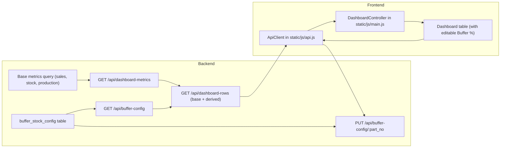

## Refactor dashboard data flow and dynamic buffer stock

### 1. Separate base metrics from derived buffer logic

- **Keep existing view as reference only**: Treat `vw_bharat_dashboard` in `[static/sql/vw_bharat_dashboard.sql](static/sql/vw_bharat_dashboard.sql)` as the source definition of the current logic, but stop exposing it directly to the frontend.
- **Identify base metrics**: From the view, extract the core columns that should come from SQL as raw metrics:
  - Monthly demand (`x.QTY`, currently aliased as `FEB`)
  - Stock snapshots (`WIP`, `FG`, `Total Stock`)
  - Produced quantity (`Produced Qty`)
- **Define which columns will be computed in Python**: Mark `Buffer Stock`, `Production Pending`, and `Balance Production Quantity` as derived in the backend, based on demand, stock, production, and a buffer percentage.

### 2. Design backend endpoints for base metrics

- **Create a new metrics API for the dashboard** in `[backend/api.py](backend/api.py)` alongside the existing `/columns` and `/rows` endpoints:
  - `GET /api/dashboard-metrics`: returns per-`PART_NO` base metrics: monthly demand, WIP, FG, total stock, produced quantity, and optionally part metadata.
- **Implement SQL for base metrics** using either:
  - A new query directly in `[backend/models.py](backend/models.py)` (e.g., `get_dashboard_base_rows`), adapted from the existing view’s subqueries (`x`, `y_wip`, `y_fg`, `z`), but only selecting base metrics, or
  - A lighter SQL view/table that exposes only these base metrics (e.g., `vw_bharat_base_metrics`), then query it from Python.
- **Reuse existing pagination & sorting patterns**: Mirror the signature of `get_rows` (page, page_size, search, sort_by, sort_dir), but apply them to the base metrics query rather than `TARGET_TABLE_NAME`.

### 3. Introduce buffer configuration storage in the database

- **Add a `buffer_stock_config` table** (via migration or SQL file, close to your existing `vw_bharat_dashboard` script) with at least:
  - `part_no` (PK, VARCHAR, referencing your part master or components)
  - `buffer_pct` (DECIMAL, representing 0.0–1.0; e.g., 0.3 for 30%)
  - Optional audit columns (`updated_by`, `updated_at`).
- **Define default behavior**: When no row exists for a part, treat `buffer_pct` as 0.0 by default, so buffer stock is zero and only demand, stock, and production drive the other columns.

### 4. Backend APIs for buffer stock configuration

- **Read API**:
  - `GET /api/buffer-config`: returns buffer configuration per `PART_NO`, either as a flat list or keyed by part number.
  - Implement in `[backend/api.py](backend/api.py)` using small helper functions in `[backend/models.py](backend/models.py)` to query `buffer_stock_config`.
- **Write APIs** (insert/update):
  - `PUT /api/buffer-config/<part_no>`: upsert a single part’s buffer percentage.
  - Optionally `POST /api/buffer-config/bulk`: accept an array of `{ part_no, buffer_pct }` to update multiple parts in one call.
  - Validate that `buffer_pct` is between 0.0 and a reasonable max (e.g., 1.0 or 2.0).
- **Apply defaults in code**: When combining metrics with buffer config, use `buffer_pct = config.get(part_no, 0.0)` to represent the “assume 0%” rule.

### 5. Compute derived columns in the backend service layer

- **Create a new composition function** in `[backend/models.py](backend/models.py)` (or a separate module) that:
  - Calls the base metrics query (or uses pre-fetched data) to get rows per `PART_NO`.
  - Loads all buffer configs into a dictionary keyed by `PART_NO`.
  - For each row, computes:
    - `buffer_stock = round(monthly_demand * buffer_pct)`
    - `production_pending = round(monthly_demand * (1 + buffer_pct)) - total_stock`
    - `balance_production_qty = production_pending - produced_qty`
  - Returns rows enriched with the derived fields and the active `buffer_pct`.
- **New API endpoint for enriched rows**:
  - `GET /api/dashboard-rows`: wraps the base metrics and buffer config, returning the complete dataset needed by the dashboard (base + derived columns) with metadata about columns.
  - Either:
    - Reuse the existing `get_rows` response structure (including `columns` and `rows`), or
    - Define a custom shape for the dashboard that the frontend will expect.

### 6. Client-side integration and in-memory caching

- **Extend the JS API client** in `[static/js/api.js](static/js/api.js)`:
  - Add `getDashboardRows(params)` to call `/api/dashboard-rows` instead of `/api/rows` for the main table.
  - Add `updateBufferConfig(partNo, bufferPct)` (and optionally `getBufferConfig`) to call the new buffer APIs.
- **Update the controller** in `[static/js/main.js](static/js/main.js)`:
  - In `loadInitial` and `reload`, switch from `ApiClient.getRows` to the new `getDashboardRows` so the table receives base + derived columns.
  - Maintain a simple in-memory cache of the last fetched rows and timestamp (e.g., a module-level variable in `main.js` or a separate state object), and only call the backend again when:
    - User performs a **hard refresh** via a button.
    - A scheduled **daily refresh** is due (e.g., compare `Date.now()` with the last fetch time and a configured threshold).
    - The user changes filters that should genuinely result in a different dataset (search, sort, pagination).

### 7. UI/UX for buffer percentage editing

- **Add an editable ‘Buffer %’ column** in the table:
  - Ensure the backend exposes a `buffer_pct` field in the metadata so that the frontend can render it as an editable cell.
  - In `[static/js/table.js](static/js/table.js)`, modify row rendering:
    - For normal columns, keep the existing text rendering.
    - For the `buffer_pct` column, render an `<input>` (or inline editable span) inside the cell, bound to the row’s `PART_NO`.
- **Wire up change handling**:
  - On input blur or enter key, send a `updateBufferConfig(partNo, newPct)` request.
  - On success:
    - Update the in-memory row for that `PART_NO` with the new `buffer_pct`.
    - Re-run the derived calculations on the client, or simply trigger a call to `/api/dashboard-rows` to get a refreshed dataset for that part/page.
- **Placement**:
  - Ensure columns are ordered so that the `Buffer %` (or `Buffer Stock`) column appears immediately after the monthly sales/demand column, as you described.

### 8. Refresh strategies and manual controls

- **Manual refresh button**:
  - In the dashboard header (e.g., `templates/index.html`), add a button for “Hard Refresh”.
  - Wire it in `[static/js/main.js](static/js/main.js)` to:
    - Clear the local cache (if any) and force a call to `getDashboardRows` regardless of last fetch time.
- **Daily refresh logic**:
  - Track the last successful full data fetch time in JavaScript.
  - On page load or when the user interacts after a long period, if the last fetch is older than a day, automatically call the backend to refresh base metrics and derived data.
- **Backend consistency**:
  - Ensure that base metrics endpoints always query the latest transactional data (sales, stock, production), so that refreshes are meaningful and reflect current values.

### 9. Optional: architectural diagram

### 10. Testing and validation steps

- **Unit test backend composition logic**: Given sample base metrics and buffer configs, verify that `buffer_stock`, `production_pending`, and `balance_production_qty` match the original view’s results for a fixed buffer (e.g., 30%).
- **Endpoint-level tests**: Manually or via scripts, test that:
  - `GET /api/dashboard-metrics` and `GET /api/dashboard-rows` respond quickly and correctly for typical months.
  - `PUT /api/buffer-config/:part_no` updates config and is reflected in subsequent dashboard responses.
- **UI tests**:
  - Confirm that editing `Buffer %` for a specific part updates only that row’s derived columns (or the whole table) and persists after a full reload.
  - Verify daily and manual refresh behavior, ensuring that data ages out and is refreshed as designed.

