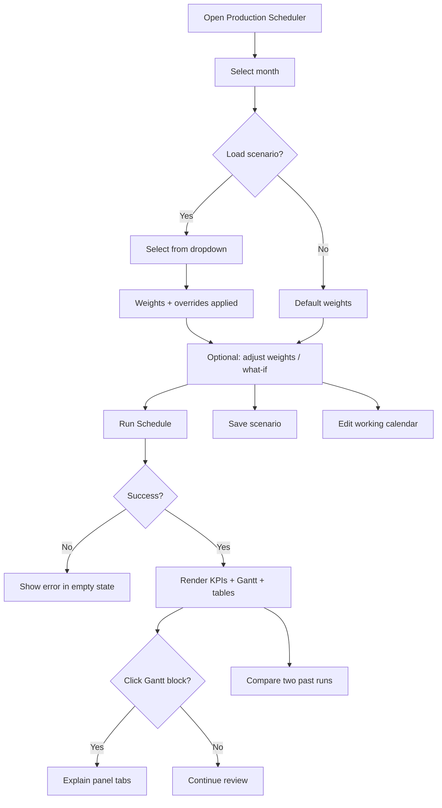

# Production Scheduler — UI Design

> Scope: Hub section `production-scheduler` only (`hub_production_scheduler.html`, `production_scheduler.js`).  
> Last updated: June 2026 · Implementation status: v1 (functional Gantt + explainability)

---

## 1. Purpose

The Production Scheduler UI lets planners **generate, inspect, and tune** a monthly machine-day production plan. It surfaces:

- An optimized **machine × day Gantt** with actuals vs planned assignments
- **KPIs** (utilization, on-time %, delays, RM coverage, tool risk, etc.)
- **Explainability** for every planned block (score breakdown, constraints, rejected alternatives)
- **Scenario management** (objective weights + what-if overrides)
- **Working calendar** overrides for non-standard days

The UI is read/write for calendar and scenarios; the schedule itself is computed server-side via `/api/scheduler/run`.

---

## 2. Access & Entry

| Item | Value |
|------|-------|
| Hub nav label | Production Scheduler |
| Nav icon | 🗓️ |
| URL | `/app?section=production-scheduler` |
| RBAC permission | `scdl` |
| API prefix | `/api/scheduler/*` |
| Init hook | `ProductionSchedulerPage.init()` on section activate (`hub.js`) |

Users without `scdl` do not see the nav item. All API routes require login + `scdl`.

---

## 3. Layout Overview

```text
┌─────────────────────────────────────────────────────────────────────────────┐
│ TOOLBAR: Title · Month · Scenario · [Run Schedule] [Compare] [Calendar]    │
├─────────────────────────────────────────────────────────────────────────────┤
│ COMPARE BAR (optional): Run A vs Run B · [Compare]                          │
├─────────────────────────────────────────────────────────────────────────────┤
│ CALENDAR PANEL (optional): Working days grid for selected month           │
├──────────────┬──────────────────────────────────────────────────────────────┤
│ SIDEBAR      │ MAIN CONTENT                                                 │
│ 260px fixed  │                                                              │
│              │  Schedule-from badge (when mid-month)                        │
│ Objective    │  KPI row (9 cards)                                           │
│ Weights      │  Run Analysis (collapsible narrative)                        │
│              │  Gantt grid (scroll-x)                                       │
│ What-If      │  Machine Utilization table (collapsible)                     │
│ Overrides    │  Improvement Log (collapsible)                               │
│              │  Unscheduled Parts table                                     │
└──────────────┴──────────────────────────────────────────────────────────────┘
                                                          ┌──────────────────┐
                                                          │ EXPLAIN PANEL    │
                                                          │ 440px slide-out  │
                                                          │ (fixed right)    │
                                                          └──────────────────┘
```

**Grid:** CSS `ps-layout` — `260px | 1fr`, full viewport height minus hub chrome (~120px).

**Responsive note:** v1 is desktop-first. Sidebar + wide Gantt assume ≥1280px width; horizontal scroll on Gantt handles narrower viewports.

---

## 4. Screen States

| State | Visible elements | Trigger |
|-------|------------------|---------|
| **Empty** | Toolbar + empty message | Initial load, or failed run |
| **Loading** | Toolbar + spinner + “Running scheduler…” | `POST /run` in flight |
| **Results** | Full layout (sidebar + main) | Successful run |
| **Explain open** | Results + right panel overlay | Click planned Gantt block |
| **Compare mode** | Compare bar below toolbar | Toggle **Compare** |
| **Calendar open** | Calendar panel below toolbar | Toggle **Calendar** |

### Empty state copy

> Select month and click **Run Schedule** to generate an optimized production plan.

On error, the empty area shows the error message in red (`#c0392b`).

---

## 5. Toolbar

### 5.1 Left block

| Element | ID | Content |
|---------|-----|---------|
| Icon | — | 📅 (Unicode calendar) |
| Title | — | Production Scheduler |
| Subtitle | `#ps-subtitle` | “Optimized machine-day assignment with explainability” |

Uses shared hub pattern: `ti-dc-toolbar`, `ti-dc-toolbar--all-in-one`.

### 5.2 Right actions

| Control | ID | Type | Behavior |
|---------|-----|------|----------|
| Month | `#ps-month-input` | `<input type="month">` | Defaults to current month. Change clears loaded scenario and reloads scenario list. |
| Scenario | `#ps-scenario-select` | `<select>` | “New scenario” + saved scenarios for month/year. Load applies weights + blocked machines. |
| Run Schedule | `#ps-run-btn` | Primary button | `POST /run` with month, year, weights, overrides, optional scenario_id |
| Compare | `#ps-compare-toggle` | Outline button | Shows/hides compare bar; loads run list |
| Calendar | `#ps-calendar-btn` | Outline button | Shows/hides working calendar panel; fetches calendar on open |

---

## 6. Left Sidebar

### 6.1 Objective Weights

Six range sliders (0–100, displayed as 0.00–1.00). Influence job ordering and machine selection in the engine.

| Label | Element ID | Weight key | Default |
|-------|------------|------------|---------|
| Dispatch Urgency | `#ps-w-urgency` | `w_urgency` | 0.35 |
| Utilization | `#ps-w-utilize` | `w_utilize` | 0.20 |
| Primary Machine | `#ps-w-primary` | `w_primary` | 0.15 |
| PM/Tool Risk | `#ps-w-pm` | `w_pm_risk` | 0.15 |
| Changeover | `#ps-w-changeover` | `w_changeover` | 0.10 |
| Idle Penalty | `#ps-w-idle` | `w_idle` | 0.05 |

**Hint text:** “Weights influence job ordering and machine selection. Higher values amplify that factor.”

| Action | ID | Behavior |
|--------|-----|----------|
| Reset | `#ps-weights-reset` | Restore default weights |
| Save | `#ps-save-scenario-btn` | Prompt for name → `POST /scenario` (create or update selected scenario) |

Live value display: `.ps-w-val` monospace, updates on slider `input`.

### 6.2 What-If Overrides

Allows manual constraints before running without editing master data.

| Control | ID | Purpose |
|---------|-----|---------|
| Pin list | `#ps-whatif-pins` | Read-only summary of active pins/boosts |
| Part No | `#ps-whatif-part` | Part identifier (case-insensitive key) |
| Action | `#ps-whatif-action` | `boost` · `pin_machine` · `pin_day` |
| Value | `#ps-whatif-value` | Boost amount, machine ID, or day number |
| Add | `#ps-whatif-add` | Append override to in-memory scenario |
| Block machines | `#ps-whatif-blocked` | Comma-separated machine IDs → `overrides.blocked_machines` |

**Override JSON shape (sent with run/save):**

```json
{
  "boosts": { "part123": 10 },
  "pins": { "part456": { "machine_id": 5, "day": 12 } },
  "blocked_machines": [5, 12]
}
```

**Gap (v1):** No per-pin remove control; refresh scenario or start “New scenario” to clear.

---

## 7. Main Content Area

### 7.1 Schedule-from badge

| Element | ID | When shown |
|---------|-----|------------|
| Badge container | `#ps-schedule-badge` | `schedule_from_day > 1` |
| Badge text | `#ps-badge-text` | e.g. “Scheduling from Day 12 (today) — earlier days show actuals” |

Style: `.ps-badge` — blue pill (`#e3f2fd` / `#1565c0`).

### 7.2 KPI row

Horizontal flex wrap of nine cards (`.ps-kpi-card`).

| Label | Element ID | Source field | Format |
|-------|------------|--------------|--------|
| Utilization | `#ps-kpi-util` | `kpi.overall_utilization_pct` | `NN%` |
| On-Time | `#ps-kpi-ontime` | `kpi.on_time_pct` | `NN%` |
| Delay Days | `#ps-kpi-delay` | `kpi.total_delay_days` | integer |
| RM Coverage | `#ps-kpi-rm` | `kpi.rm_coverage_pct` | `NN%` |
| PM Risk | `#ps-kpi-pm` | `kpi.pm_risk_tool_count` | count |
| Changeovers | `#ps-kpi-chg` | `kpi.avg_changeovers_per_machine_day` | decimal |
| Makespan | `#ps-kpi-makespan` | `kpi.makespan_day` | `Day N` or `—` |
| Overflow | `#ps-kpi-overflow` | `kpi.overflow_minutes_total` | `Nm` or `0` |
| Unscheduled | `#ps-kpi-unsched` | `kpi.unscheduled_count` | count |

Card anatomy: uppercase 10px label (`.ps-kpi-label`), 18px bold value (`.ps-kpi-value`).

### 7.3 Run Analysis

| Element | ID | Behavior |
|---------|-----|----------|
| Section | `#ps-analysis-section` | Hidden if `analysis.narrative` empty |
| Toggle header | `#ps-analysis-toggle` | Click collapses `#ps-analysis-body` |
| List | `#ps-narrative` | Bullet list of narrative strings from engine |

### 7.4 Gantt grid

Primary visualization: **machines (rows) × calendar days (columns)**.

| Property | Spec |
|----------|------|
| Container | `#ps-gantt-wrapper` — horizontal scroll |
| Table | `.ps-gantt-table`, 11px font |
| Machine column | Sticky left, 110px min, `.ps-gantt-machine-col` / `.ps-gantt-machine-cell` |
| Day columns | 56px min, headers 1…maxDay (≥28) |
| Past days | Before `schedule_from_day`: `.ps-gantt-past` grey background |
| Empty cell | `.ps-gantt-empty` |
| Assignment block | `.ps-gantt-block` — rounded, white text, part color by hash |
| Actual block | `.ps-gantt-block.ps-actual` — dashed border, 55% opacity, suffix `A`, not clickable |

**Block content:** `{part_no}` line break `{qty}` (planned) or `{qty} A` (actual).

**Tooltip (title attr):** `{part_no}: {qty} pcs, {run_minutes} min [(Actual)]`

**Colors:** 15-color Tableau-style palette assigned consistently per `part_no` for the session.

**Interaction:** Click **planned** block → open explain panel with assignment index. Actual blocks are display-only.

### 7.5 Machine Utilization table

| Column | Source |
|--------|--------|
| Machine | `machine_name` |
| Used (min) | `used_minutes` |
| Available (min) | `available_minutes` |
| Utilization | Bar + `%` — green ≤60%, amber 60–85%, red >85% |
| Changeovers | `changeovers` |
| Overflow (min) | `overflow_minutes` |

Collapsible via `#ps-machine-toggle`. Hidden if `kpi.per_machine` empty.

### 7.6 Improvement Log

Collapsible list (`#ps-improve-list`) of local-improvement pass messages. Hidden if empty.

### 7.7 Unscheduled Parts

Always-visible section when items exist.

| Column | Field |
|--------|-------|
| Part No | `part_no` |
| Part Name | `part_name` |
| Remaining Qty | `qty_remaining` (rounded) |
| Reason | `reason` (constraint failure explanation) |

---

## 8. Explanation Panel (Slide-out)

Fixed right drawer, 440px wide, full viewport height, z-index 1000.

| Element | ID |
|---------|-----|
| Panel | `#ps-explain-panel` |
| Title | `#ps-explain-title` — “Assignment Details” |
| Close | `#ps-explain-close` — × |
| Tabs | `#ps-explain-tabs` |
| Body | `#ps-explain-body` |

### 8.1 Tabs

| Tab | `data-tab` | Content |
|-----|------------|---------|
| Assignment | `assignment` | Summary, total score, factor breakdown bars, constraint badges, rejected alternatives |
| Machine Day | `machine-day` | Capacity used/available, overflow, changeovers; other parts same machine-day |
| Part Trace | `part-trace` | Total vs scheduled qty, machines used, dispatch checkpoints, all assignments for part |

### 8.2 Assignment tab detail

**Summary block:** part, machine, day, qty, run minutes, strokes.

**Score breakdown:** Each factor row shows:
- Key name (120px)
- Horizontal bar (green positive / red negative contribution)
- Numeric contribution (+0.000)
- Truncated reason string

**Constraints:** Inline badges — `.ps-ok` (pass) / `.ps-fail` (fail) per check name.

**Rejected alternatives:** Yellow callout cards (`.ps-explain-alt`) with machine + reason.

---

## 9. Compare Mode

Compare bar (`#ps-compare-bar`) appears below toolbar when toggled.

| Control | ID | Behavior |
|---------|-----|----------|
| Run A | `#ps-compare-a` | Completed runs for selected month (last 20) |
| Run B | `#ps-compare-b` | Same |
| Compare | `#ps-compare-run` | `POST /compare` → snackbar with added/removed/changed counts |

**Run option label:** `#${run_id} ${scenario_name} (${completed_at})`

**Gap (v1):** No visual diff overlay on Gantt; comparison is summary toast only. Future: split Gantt or highlight moved (yellow), new (green), removed (red).

---

## 10. Working Calendar Panel

Panel `#ps-calendar-panel` toggled from toolbar.

**Grid columns:** Day · Weekday · Working (checkbox) · Hours · Notes

| Row state | Style |
|-----------|-------|
| Non-working day | `.ps-cal-off` — light red background |
| Working day | Default |

**Interaction:** Toggle checkbox → `PUT /working-calendar/{date}` with `{ is_working: bool }` → reload grid.

**Hours column:** Displays `shift_hours` or `default_hours` (from config `WORK_HOURS_PER_DAY`, default 6). Read-only in UI v1.

**Gap (v1):** No inline edit for `shift_hours` or `notes` despite API support.

---

## 11. Visual Design System

### 11.1 CSS variables (inherit from hub / titanium)

| Token | Default | Usage |
|-------|---------|-------|
| `--bg-surface` | `#f7f8fa` | Sidebar, KPI cards, panels |
| `--bg-panel` | `#fff` | Main panel, explain drawer |
| `--border` | `#e0e0e0` | Borders, dividers |
| `--text-primary` | `#222` | Body text |
| `--text-muted` | `#888` | Hints, secondary labels |
| `--primary` | `#4e79a7` | Active tab underline, accents |

### 11.2 Shared hub components

- `ti-btn`, `ti-btn-primary`, `ti-btn-outline`, `ti-btn-sm`
- `ti-input`, `ti-select`, `ti-select--compact`
- `ti-spinner` (loading)
- Snackbar via `Hub.utils.snackbar`

### 11.3 Semantic colors

| Meaning | Background | Text |
|---------|------------|------|
| Pass / on-time | `#d4edda` | `#155724` |
| Fail / late | `#f8d7da` | `#721c24` |
| At-risk | `#fff3cd` | `#856404` |
| Utilization low | bar `#59a14f` | — |
| Utilization medium | bar `#f28e2b` | — |
| Utilization high | bar `#e15759` | — |

### 11.4 Typography

| Context | Size | Weight |
|---------|------|--------|
| Section h4 | 14px | 600 |
| Gantt table | 11px | normal / 600 (machine col) |
| KPI value | 18px | 700 |
| KPI label | 10px uppercase | normal |
| Hints | 12px | normal, muted |

---

## 12. User Flows



### 12.1 Primary flow — generate plan

1. Pick month (defaults to today’s month).
2. Optionally select or save a scenario with tuned weights.
3. Click **Run Schedule**.
4. Review KPIs, Gantt, unscheduled list.
5. Drill into blocks for explainability.

### 12.2 Scenario flow

1. Adjust sliders and/or what-if overrides.
2. **Save** → name prompt → persisted to `scheduler_scenario`.
3. Re-select scenario later to restore weights/overrides for that month.

### 12.3 Mid-month scheduling

When today falls inside the selected month, engine sets `schedule_from_day` to today’s day number. Days before show **actual** production (dashed blocks); days from today forward show **planned** assignments.

---

## 13. API ↔ UI Mapping

| UI action | Method | Endpoint | Request body / params |
|-----------|--------|----------|------------------------|
| Load calendar | GET | `/working-calendar/{month}/{year}` | — |
| Toggle working day | PUT | `/working-calendar/{date}` | `{ is_working }` |
| List scenarios | GET | `/scenarios?month=&year=` | — |
| Load scenario | GET | `/scenario/{id}` | — |
| Save scenario | POST | `/scenario` | `{ scenario_id?, name, month, year, weights, overrides, frozen_days }` |
| Run scheduler | POST | `/run` | `{ scenario_id?, month, year, weights, overrides }` |
| List runs (compare) | GET | `/runs?month=&year=` | — |
| Compare runs | POST | `/compare` | `{ run_a, run_b }` |

**Run response fields used by UI:**

- `assignments[]`, `actuals[]`, `schedule_from_day`
- `kpi` (all KPI + `per_machine`, `per_machine_per_day`)
- `analysis` (`narrative`, `part_traces`)
- `improvement_log[]`, `unscheduled[]`
- Per-assignment: `score`, `constraints_checked` (explain panel)

---

## 14. Feedback & Errors

| Event | Feedback |
|-------|----------|
| Run success | Snackbar: “Schedule generated” |
| Run failure | Snackbar + red message in empty area |
| Scenario loaded | Snackbar: “Loaded scenario: {name}” |
| Scenario saved | Snackbar: “Scenario saved” |
| Compare complete | Snackbar: counts of added/removed/changed |
| Calendar update error | Snackbar with API message |
| Validation (what-if) | Snackbar: “Enter part and value” |

All API errors surface `message` or `error` from JSON response.

---

## 15. Accessibility (v1 baseline)

| Item | Status |
|------|--------|
| Month filter | `role="group"` + `aria-label="Month"` |
| Scenario filter | `aria-label="Scenario"` |
| Gantt blocks | `title` tooltip; click target ≥ block padding |
| Explain close | Button with × character |
| Collapsible sections | Click headers; no `aria-expanded` yet |
| Keyboard nav for Gantt | Not implemented |
| Focus trap in explain panel | Not implemented |

**Recommended v2:** `aria-expanded` on toggles, Escape to close explain panel, roving tabindex on Gantt blocks.

---

## 16. File Map

| File | Role |
|------|------|
| `templates/hub_production_scheduler.html` | Markup + scoped CSS |
| `static/js/production_scheduler.js` | State, API, render logic |
| `static/js/hub.js` | Section routing, `init()` dispatch |
| `templates/hub.html` | Nav link, conditional on `has_scdl` |
| `backend/scheduler/api.py` | REST endpoints |

Section-scoped styles live inline in the template (prefix `ps-`). No separate CSS file for scheduler.

---

## 17. Known Gaps & Future UI Work

Items from product plan not yet fully reflected in UI:

| Feature | Plan intent | v1 status |
|---------|-------------|-----------|
| Compare diff Gantt | Split view with color-coded moves | Toast summary only |
| Frozen horizon slider | Lock first N days from replanning | `frozen_days` hardcoded 0 on save |
| Shift hours / notes edit | Full calendar admin | Display only; working toggle only |
| Remove what-if pin | Per-row delete | Not built |
| Non-working day shading in Gantt | Grey columns for calendar off-days | Past-day shading only |
| Reload past run | Pick run from history | Runs listed for compare only |
| Mobile layout | Collapsible sidebar | Desktop-first |

---

## 18. Acceptance Checklist (QA)

- [ ] User with `scdl` sees nav item and can open section
- [ ] Empty state shows until first successful run
- [ ] Month change refreshes scenario dropdown
- [ ] Run shows KPI row, Gantt, and hides loading spinner
- [ ] Actual blocks (past days) differ visually and are not clickable
- [ ] Planned block click opens explain panel; all three tabs populate
- [ ] Weight sliders update numeric labels; Reset restores defaults
- [ ] Save scenario persists and reloads on select
- [ ] What-if boost/pin/block sent on run (verify via network payload)
- [ ] Calendar toggle loads days; checkbox persists via API
- [ ] Compare mode lists runs and shows diff snackbar
- [ ] Unscheduled table appears when engine returns unscheduled parts
- [ ] Collapsible sections (analysis, machine util, improvement log) toggle correctly

---

*End of Production Scheduler UI Design*
